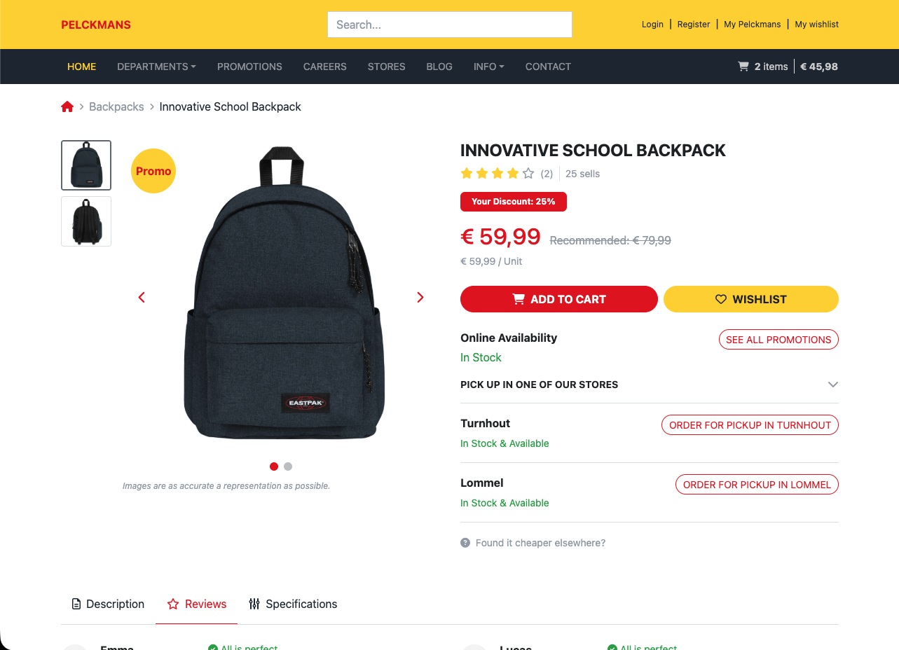
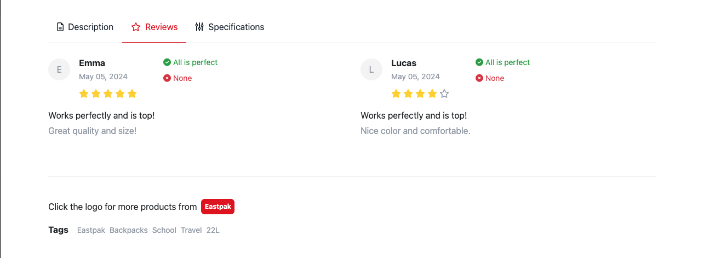
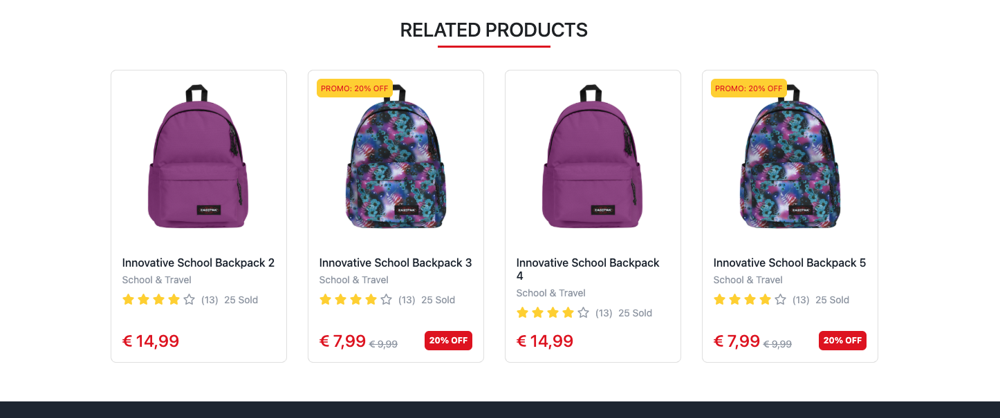
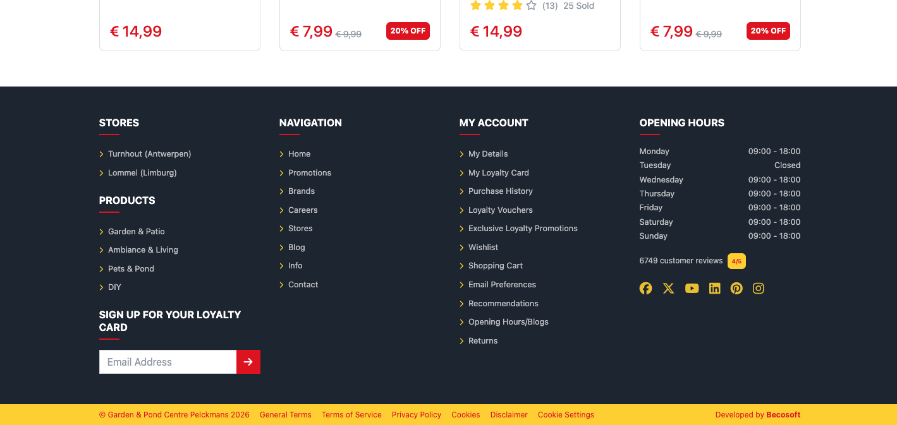
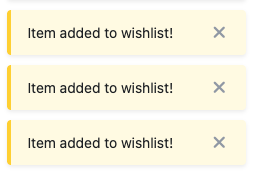
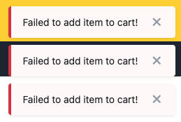

# BecoSoft Front-End Test — Product Detail Page

> ASP.NET Core 10 MVC · Bootstrap 4 · SCSS · jQuery

A fully responsive product detail page built as part of the BecoSoft front-end developer test assignment. The implementation goes beyond the base requirements — focusing on component architecture, performance, accessibility, and a clean SCSS strategy.

## Table of Contents

- [Demo](#demo)
- [Screenshots](#screenshots)
- [What Was Built](#what-was-built)
- [Tech Stack](#tech-stack)
- [Architecture Decisions](#architecture-decisions)
- [Getting Started](#getting-started)
- [`$.toastMessage` Plugin](#toastmessage-plugin)
- [Time Spent & Assumptions](#time-spent--assumptions)

---

## Demo

### Desktop


### Mobile


---

## Screenshots

| Product Hero                               | Tabs & Reviews                     |
| ------------------------------------------ | ---------------------------------- |
|  |  |

| Related Products                                   | Footer                         |
| -------------------------------------------------- | ------------------------------ |
|  |  |

| Success Toast                                | Error Toast                              |
| -------------------------------------------- | ---------------------------------------- |
|  |  |

## What Was Built

### Assignment checklist

- [x] Product image gallery with thumbnails
- [x] Product info section with the details, price, etc.
- [x] Tabs — Description, Reviews, Specifications
- [x] Related products section
- [x] Header with nav + Footer
- [x] Breadcrumbs + Brand banner
- [x] `$.toastMessage` jQuery plugin
- [x] Fully responsive — desktop / tablet / mobile

### Beyond the requirements

- Image gallery with **keyboard navigation** (`←` `→`) and **touch swipe** on mobile
- **Preload** for the first gallery image (`<link rel="preload">`) + `loading="lazy"` / `decoding="async"` for the rest
- All gallery images rendered in the DOM upfront — toggled with `d-none` for **instant switching** (no re-fetch)
- `asp-append-version="true"` on all static assets for **automatic cache-busting**
- Add to Cart and Add to Wishlist buttons trigger `$.toastMessage` calls to demonstrate the plugin in context

---

## Tech Stack

| Layer         | Technology                                 |
| ------------- | ------------------------------------------ |
| Framework     | ASP.NET Core 10 MVC (Razor)                |
| CSS           | Bootstrap 4.6.2 (SCSS source via LibMan)   |
| SCSS Compiler | AspNetCore.SassCompiler (Debug hot-reload) |
| JavaScript    | jQuery 3.5.1 slim                          |
| Icons         | Font Awesome 6.5.1                         |

---

## Architecture Decisions

### Utilities-first SCSS

Bootstrap utility classes are always preferred over custom SCSS. Custom SCSS is only written for:

- Pseudo-elements (`::before`, `::after`)
- Aspect ratios and `object-fit`
- Animations and transitions
- Values with no Bootstrap equivalent (e.g. `rgba` colors, custom `font-size`)

This results in **3 custom SCSS component files** instead of the ~10 initially scoped.

### Component structure

Each UI section is a Razor partial view with a single responsibility:

```
Views/
├── Shared/
│   ├── _Layout.cshtml
│   ├── _Header.cshtml
│   ├── _Footer.cshtml
│   ├── _Breadcrumb.cshtml
│   └── _StarRating.cshtml
└── ProductDetail/
    ├── Detail.cshtml             ← orchestrates sections, owns @section Scripts
    ├── _ProductGallery.cshtml    ← thumbnails + main image + badges
    ├── _ProductInfo.cshtml       ← price, CTA, availability, store pickup
    ├── _ProductTabs.cshtml       ← tab nav shell
    ├── _TabReviews.cshtml        ← review cards grid
    ├── _TabSpecifications.cshtml ← HTML list → table conversion via @functions
    └── _RelatedProducts.cshtml   ← product card carousel row
```

### Styles organization

```
wwwroot/scss/
├── main.scss                 ← single entry point, imports only
├── base/
│   ├── _variables.scss       ← theme tokens + Bootstrap overrides
│   ├── _base.scss            ← fluid font-size (clamp), body layout
│   └── _utilities.scss       ← custom helpers
└── components/
    ├── _header.scss
    ├── _footer.scss
    ├── _buttons.scss
    ├── _forms.scss
    ├── _badge.scss
    ├── _product-gallery.scss
    ├── _product-tabs.scss
    ├── _review-card.scss
    └── _toastMessage.scss
```

---

## Getting Started

**Prerequisites:** [.NET 10 SDK](https://dotnet.microsoft.com/download/dotnet/10.0)

```bash
# Quick setup (Mac/Linux)
./setup.sh

# Quick setup (Windows)
setup.cmd
```

```bash
# Run
dotnet run --project src/BecoSoft.FrontendTest.Web
# → http://localhost:5002
```

<details>
<summary>Manual setup</summary>

```bash
dotnet tool restore
dotnet restore
cd src/BecoSoft.FrontendTest.Web && dotnet libman restore && cd ../..
dotnet build
dotnet run --project src/BecoSoft.FrontendTest.Web
```

</details>

---

## `$.toastMessage` Plugin

A generic, reusable jQuery notification component built as a standalone plugin.

### Usage

```js
$.toastMessage("success", "Item added to cart!");
$.toastMessage("error", "Something went wrong.");

// With options
$.toastMessage("success", "Saved!", { duration: 5000 });
$.toastMessage("error", "Critical error — please retry.", { sticky: true });
```

### Options

| Option     | Type      | Default | Description                                        |
| ---------- | --------- | ------- | -------------------------------------------------- |
| `duration` | `number`  | `3000`  | Auto-close delay in ms — clamped between 3000–5000 |
| `sticky`   | `boolean` | `false` | Requires manual close, disables auto-close         |

### Message types

| Type                | Accent color          |
| ------------------- | --------------------- |
| `success` (Default) | Yellow (`$secondary`) |
| `error`             | Red (`$danger`)       |

### Events

Both events are emitted on `$(document)`:

```js
$(document).on("toastShown", function (e, data) {
  console.log("shown:", data.type, data.message, data.element);
});

$(document).on("toastClosed", function (e, data) {
  console.log("closed:", data.type, data.message);
});
```

### Behaviour

- Toasts **stack** — each new toast appends below the previous ones
- Close button always visible; clicking it dismisses immediately
- `sticky: true` disables auto-close

---

## Time Spent & Assumptions

**Total time:** ~10 hours

### Assumptions

- All product data is hardcoded in the controller — no database, no API calls
- Fields not present in the ViewModel (review date, sold count, store names, brand logo) were hardcoded directly in the views, as noted in the assignment
- `SpecificationsHtml` arrives as a `<ul><li>Key: Value</li>` string — converted to a `<table>` in the partial view via a `@functions` helper, keeping the controller untouched
- Bootstrap 4 was compiled from SCSS source (via LibMan) rather than loaded from CDN, to allow full theme customization through `$variables`devoluti

### Known Limitations & Planned Improvements

- The divider between the sold count and the rating is missing in the related products section (a responsive solution for text wrapping wasn't found in time)
- A few icons differ from the mockup: some could not be identified, and others are not available under the Font Awesome free tier
- The "Pick up in one of our stores" accordion flickers on both open and close
